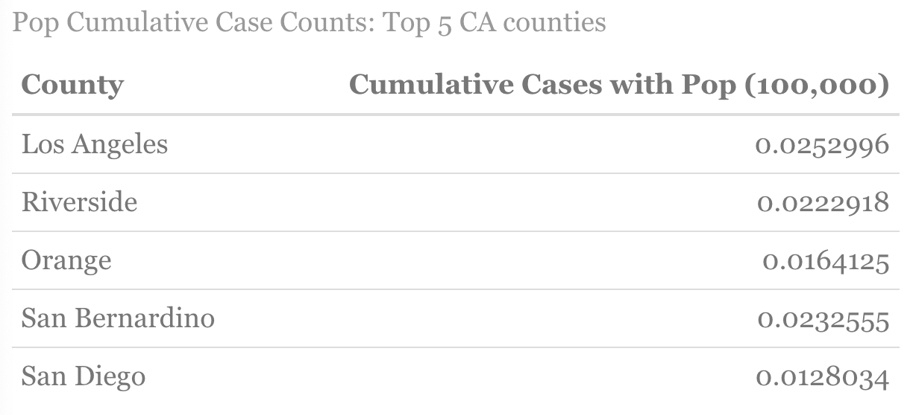
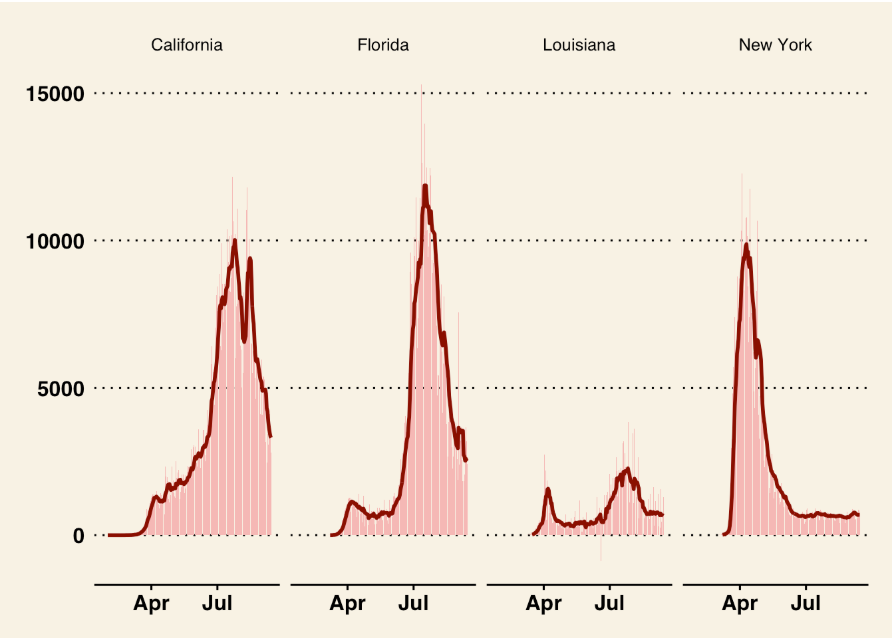
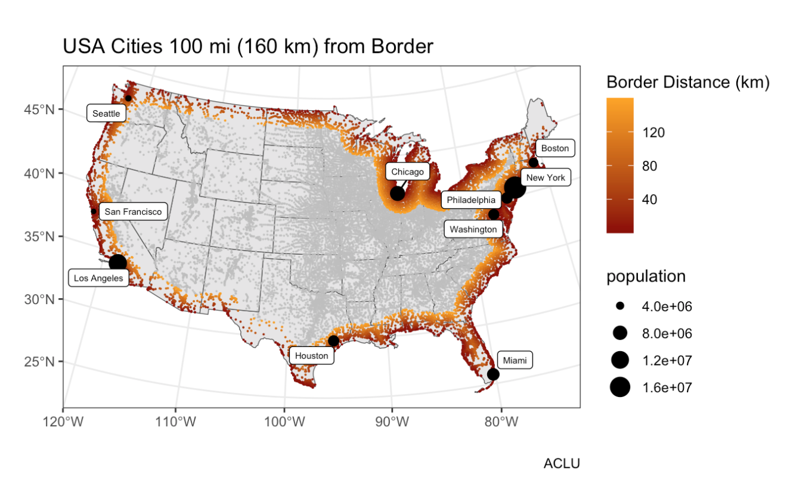
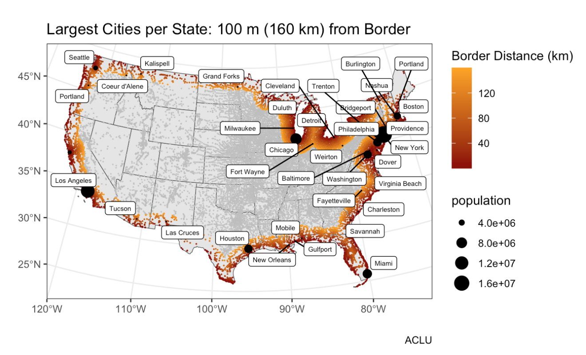
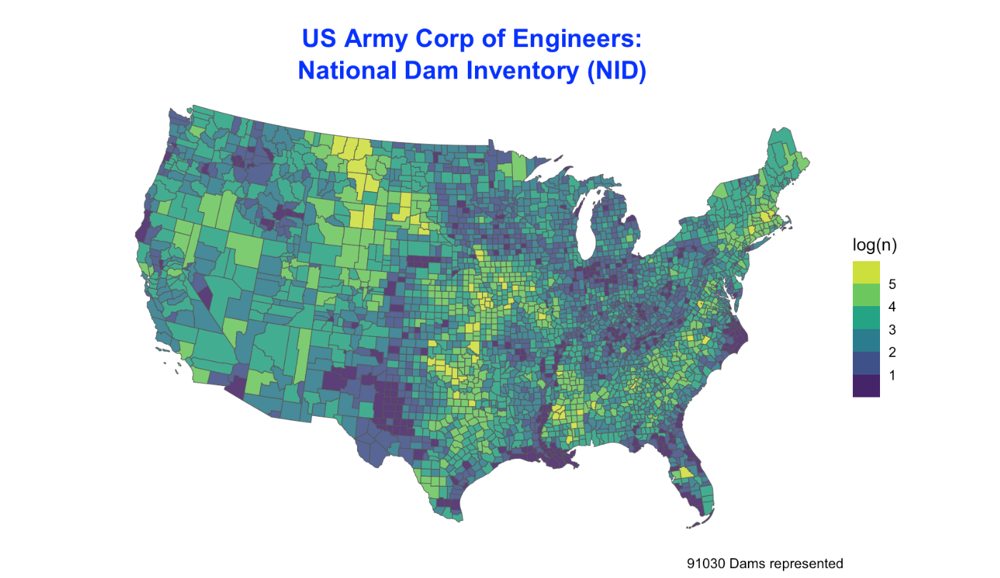
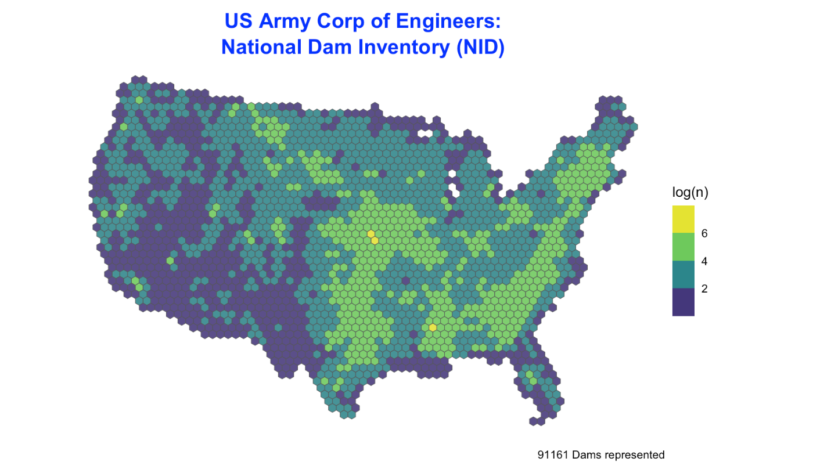
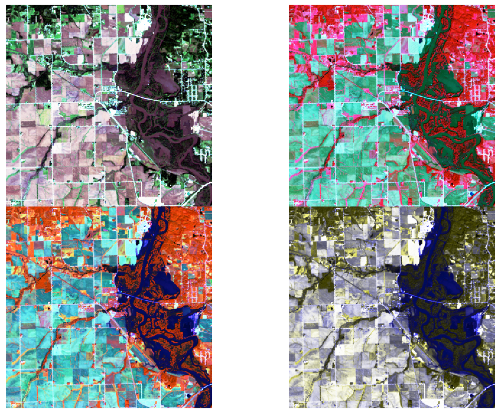
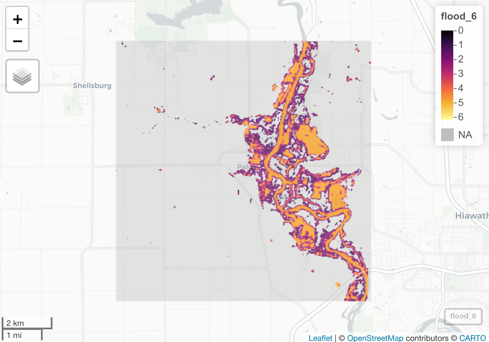

In the summer of 2020 I took a class GIS course based in R. I wrote code, and worked with data science concepts. Here is a collection of links: 

## [Building a project website](https://github.com/UCSBaporter/UCSBaporterW1.git)

- In this assignment I was able to construct a personal website using Github Pages. 
- Included is a link to my online hosted portfolio for Fashion Design.
- Beginning to establish very basic understanding of Rstudio. 
- Rstudio is a work in progress!

<i class="fas fa-map-marked-alt fa-5x" style="color:black;"></i>
<i class="fas fa-globe-americas fa-5x" style="color:blue;"></i>

---

## [Processing Covid-19 Data](https://ucsbaporter.github.io/geog176A-labs/Lab-02.html)

- In this assignment we worked with NY Times Covid-19 data to review trends in the State of California. 
- Included is a review of Covid-19 case counts for counties within the State of California.
- The included charts are designed to update with current daily information and therefore is a real-time review of how this pandemic is spreading throughout the state. 
- The charts include: Cumulative case counts for the top 5 counties, The most new case counts for the top 5 counties, as well as the top 5 counties when reviewing population (by 100,000), and lastly an alphabetical list of counties with the lowest new cases when reviewing population (by 100,000). 
- Additionally, I compared Covid-19 state data between California, Florida, Louisiana, and New York,  taking into account overall state population and cases.  
- In the future these same steps could be used to continue to monitor certain state or county features of the Covid-19 pandemic, or any other trend with the public dataset. 

---

## [Distances and the Border Zone](https://ucsbaporter.github.io/geog176A-labs/Lab-03.html)

- In this assignment we recreated the information that supported the ACLU claims that, "Nearly 2 out of 3 people (in the USA) live within the 100 mile border zone".  That new Border Patrol agents practices are working beyond their legal authority and thereby infringing on the Fourth Amendment of the U.S. Constitution. 
- Link to the ACLU article: https://www.aclu.org/other/constitution-100-mile-border-zone
- I used simple feature objects and geo measures in conjunction with combines and unions, coordinate reference systems, and distance measurements.
- The included maps review state or city distance from the Canadian and Mexican border as well as our coastal borders.

---

## [Tesselations, Point-in-Polygon](https://ucsbaporter.github.io/geog176A-labs/Lab-04.html)

- In this assignment we worked with National Dams Inventory.
- Reviewing geometry simplification, centroid generations, and tessellations.
- I used this information to review dams throughout the continental U.S. as well isolate dam features.

---

## [Rasters & Remote Sensing](https://ucsbaporter.github.io/geog176A-labs/Lab_05.html)

- In this assignment we reviewed flood map information from a flood event near Palo, Iowa.
- I reviewed the data to complete flood assisgnment of the surrounding areas.
- I reviewed different color gradients to find the best fit to show water verses land.

