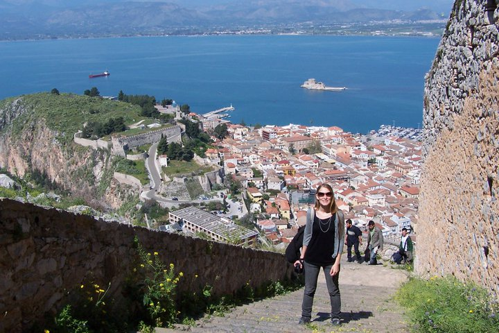
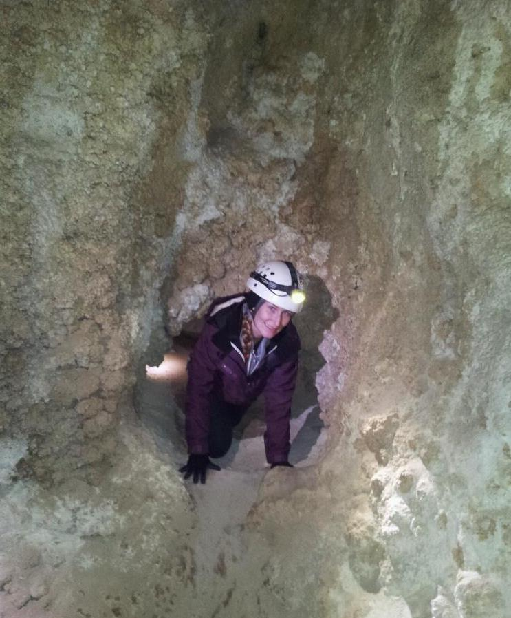
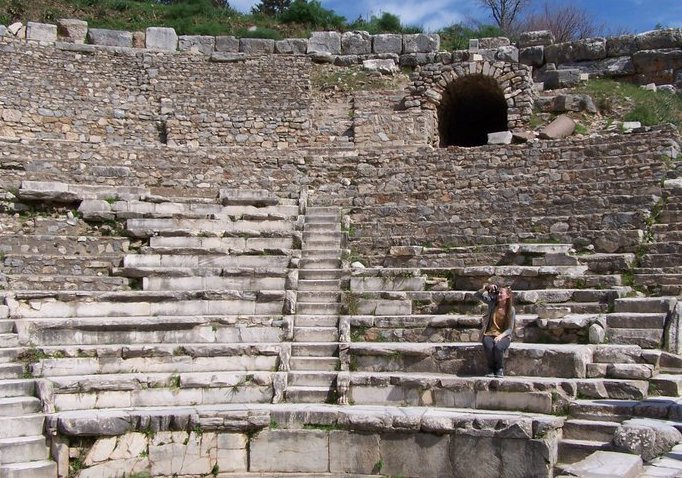

  

# Hello, my name is Abigail M Porter 

I’m a 4th year undergraduate student at the University of California Santa Barbara (UCSB), majoring in Biological Anthropology, Archaeology, and a minor in Spatial Studies (Spatial Science).  Currently, working towards an honor distinction in Biological Anthropology.  The honors project sets out to determine if domestic abuse patterns can be determined based on social structure by reviewing osteological remains from group burial sites.  Additionally, I have worked as a lab assistant in the UCSB Walker Bioarchaeology and Biochemistry Lab.  This role included dental isotope testing, human forensic recovery work in Montecito, and as a TA in ANTH 121: Human Evolution.  During the Fall '20 quarter I will continue participating as a lab assistant, and TA in ANTH 180A: Osteology (both remotely due to Covid-19).  

Summer 2019, internship which turned into a freelance position for the San Francisco Museum of Modern Art (SFMOMA) in the Conservation department, specifically on the Diego Rivera “Pan American Unity” mural.  Additionally, I have completed an AA in Psychology and Fashion Design.          

Email: amp4design@gmail.com

Github: https://github.com/UCSBaporter

Fashion Design Portfolio: https://www.coroflot.com/abigailmporter

<i class="fas fa-home fa-5x" style="color:blue;"></i> 